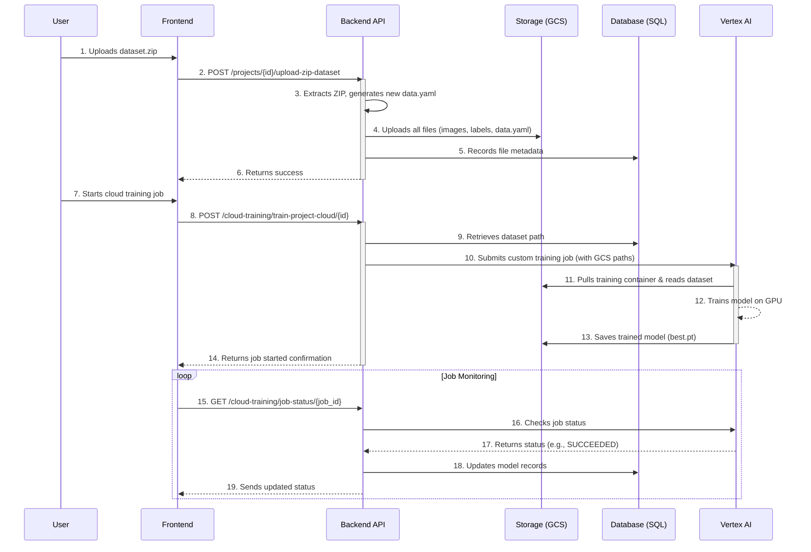
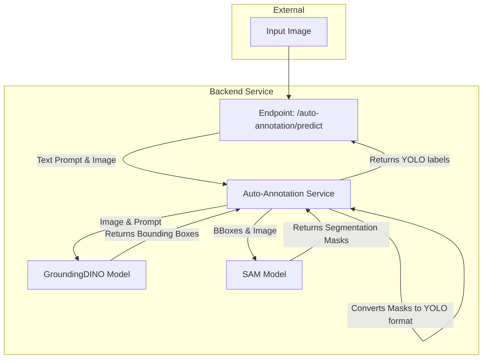
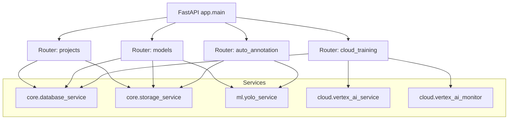
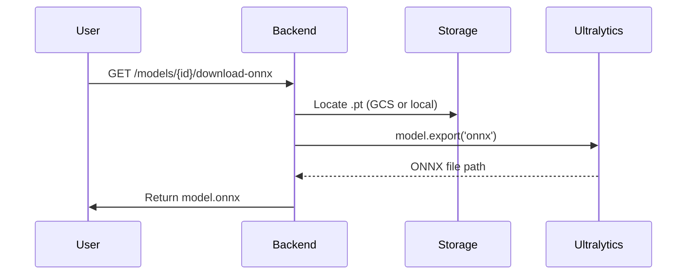
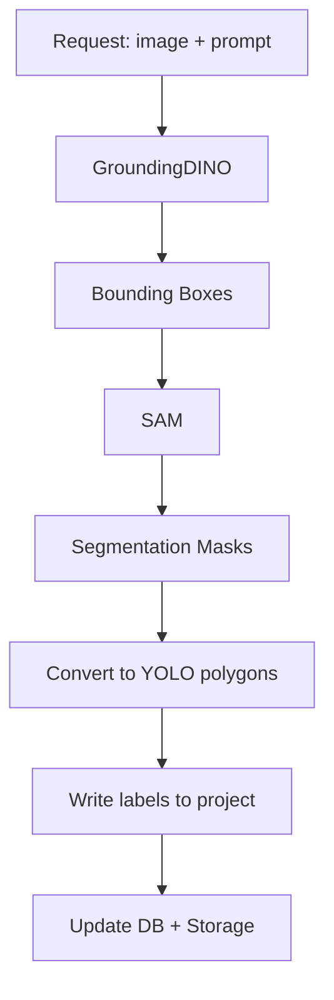
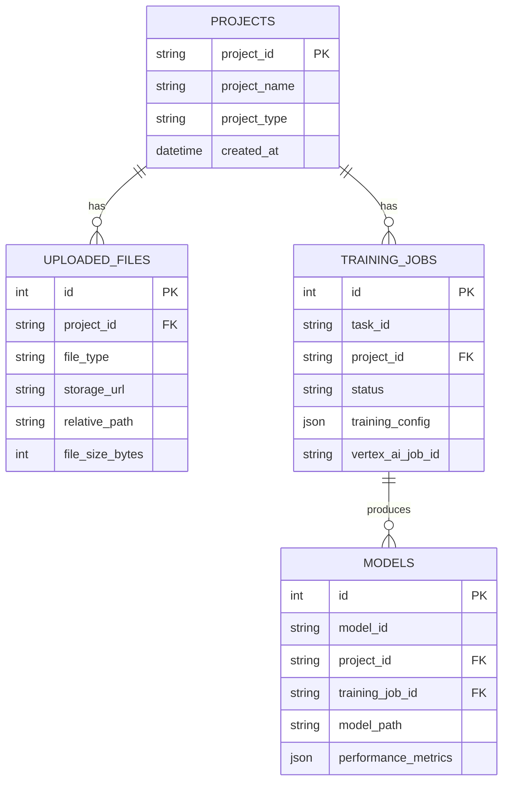
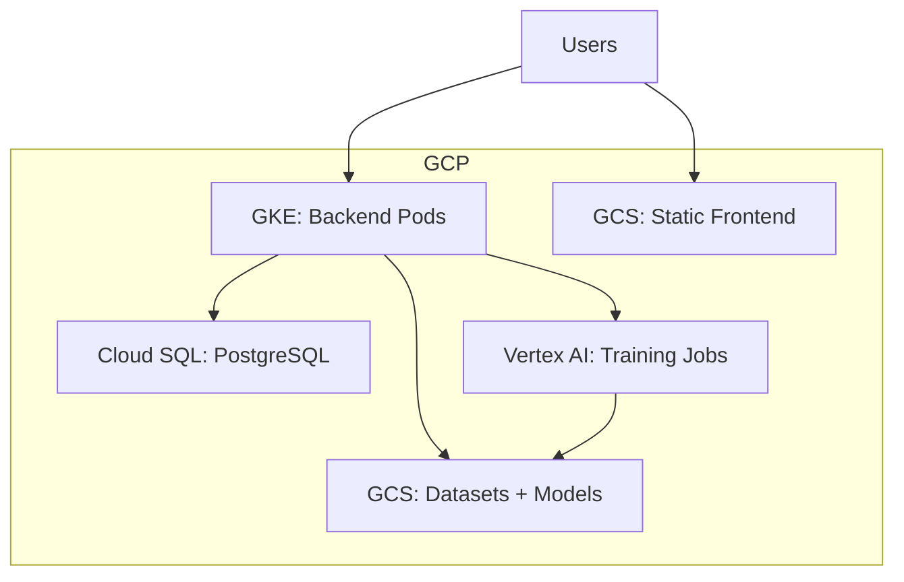

# System Design & Feature Diagrams

This document contains diagrams illustrating the system architecture and data flows.

## 1. High-Level System Architecture

This diagram shows the main components of the platform and how they interact.

```mermaid
graph TD
    subgraph User
        A[Browser]
    end

    subgraph Cloud Platform
        B[Frontend (React on GCS)]
        C[Backend (FastAPI on GKE)]
        D[Database (Cloud SQL)]
        E[File Storage (GCS)]
        F[ML Training (Vertex AI)]
    end

    A -- HTTPS --> B
    A -- API Calls --> C
    B -- Serves Static Files --> A
    C -- CRUD Operations --> D
    C -- Read/Write Files --> E
    C -- Submits & Monitors Jobs --> F
    F -- Reads Data & Writes Models --> E
    F -- Updates Status --> C
```

**Flow Description:**
1.  The user interacts with the **Frontend** served from a GCS bucket.
2.  The Frontend makes API calls to the **Backend** running on GKE.
3.  The Backend handles business logic, storing metadata in the **Database** and files (datasets, models) in **GCS**.
4.  For training, the Backend submits a job to **Vertex AI**, which reads data from and writes models back to GCS.

---

### ASCII: High-Level System Architecture

```
Users (Browser)
   │
   ├── HTTPS → Frontend (React on GCS)
   │            └─ serves static files
   │
   └── API Calls → Backend (FastAPI on GKE)
                   ├─ CRUD → Database (Cloud SQL/PostgreSQL)
                   ├─ Read/Write → File Storage (GCS)
                   └─ Submit & Monitor → ML Training (Vertex AI)
                                      ├─ Reads Data (GCS)
                                      └─ Writes Models (GCS)
```

## 2. Feature Diagram: ZIP Dataset Upload and Cloud Training

This diagram details the sequence of events from uploading a dataset to completing a cloud training job.



---

### ASCII: ZIP Dataset Upload and Cloud Training (Sequence)

```
1) User uploads dataset.zip → Frontend → Backend
2) Backend extracts ZIP, generates cloud-safe data.yaml
3) Backend uploads files → GCS: projects/{project_id}/
4) Backend records metadata → Database
5) User starts training → Frontend → Backend
6) Backend resolves dataset, submits job → Vertex AI
7) Vertex AI pulls container, reads data from GCS, trains
8) Vertex AI writes outputs (best.pt, logs) → GCS (mltraining-models)
9) Monitor updates DB → Frontend shows completion
```

## 3. Feature Diagram: Auto-Annotation Data Flow

This diagram shows how the auto-annotation service processes an image to generate labels.



**Flow Description:**
1.  An **Input Image** and a text prompt (e.g., "a scratch on a metal plate") are sent to the backend endpoint.
2.  The **Auto-Annotation Service** receives the request.
3.  It first passes the image and prompt to the **GroundingDINO Model**, which detects the object based on the text and returns coarse bounding boxes.
4.  The service then passes the image and the bounding boxes to the **SAM (Segment Anything) Model**.
5.  SAM returns precise segmentation masks for the objects within the boxes.
6.  The service converts these masks into the YOLO polygon format.
7.  The final YOLO-formatted labels are returned to the user.

---

### ASCII: Auto-Annotation Data Flow

```
[Input Image + Text Prompt]
       │
       ├─→ GroundingDINO → [Bounding Boxes]
       │
       ├─→ SAM (with bboxes) → [Segmentation Masks]
       │
       ├─→ Convert Masks → YOLO polygons (.txt labels)
       │
       └─→ Write labels to project (GCS) + Update DB
```

## 4. Backend Module Map



---

### ASCII: Backend Module Map

```
FastAPI app.main
 ├─ Router: projects → core.database_service, core.storage_service
 ├─ Router: models   → core.database_service, core.storage_service, ml.yolo_service
 ├─ Router: cloud_training → core.database_service, cloud.vertex_ai_service, cloud.vertex_ai_monitor
 └─ Router: auto_annotation → ml.yolo_service, core.storage_service
```

## 5. Storage Paths & Artifacts

```mermaid
graph LR
    subgraph Projects Bucket (GCS)
    A[projects/{project_id}/] --> A1[images/train]
    A --> A2[images/val]
    A --> A3[labels/train]
    A --> A4[labels/val]
    A --> A5[data.yaml]
    end

    subgraph Models Bucket (GCS)
    B[mltraining-models/] --> B1[detection/{training_id}/best.pt]
    B --> B2[detection/{training_id}/model.onnx]
    B --> B3[segmentation/{training_id}/best.pt]
    end
```

---

### ASCII: Storage Paths & Artifacts

```
GCS (projects)
 └─ projects/{project_id}/
    ├─ images/train/
    ├─ images/val/
    ├─ labels/train/
    ├─ labels/val/
    └─ data.yaml

GCS (models)
 └─ mltraining-models/
    ├─ detection/{training_id}/best.pt
    ├─ detection/{training_id}/model.onnx
    └─ segmentation/{training_id}/best.pt
```

## 6. ONNX Export Sequence



---

### ASCII: ONNX Export Sequence

```
User → Backend → Locate .pt (GCS/local)
       → Ultralytics export(onnx)
       → Backend → Return model.onnx → User
```

## 7. Auto-Annotation Swimlane (Detailed)



## 8. Database ER (Logical)



---

### ASCII: Database ER (Logical)

```
PROJECTS (project_id PK)
 ├─< UPLOADED_FILES (project_id FK)
 └─< TRAINING_JOBS (project_id FK)
      └─< MODELS (training_job_id FK)

MODELS — (project_id FK) → PROJECTS
```

## 9. Deployment Topology



---

### ASCII: Deployment Topology

```
Users
 ├─→ GCS (Frontend static hosting)
 └─→ GKE (Backend pods)
      ├─→ Cloud SQL (PostgreSQL)
      ├─→ GCS (Datasets & Models)
      └─→ Vertex AI (Training Jobs) ─→ GCS (Artifacts)
```
